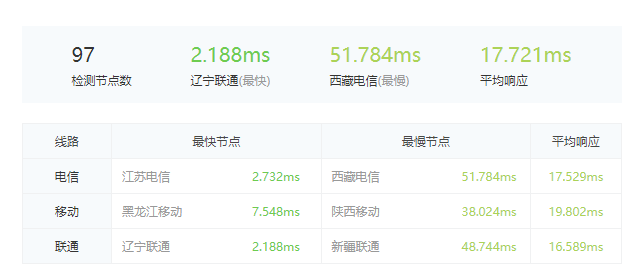
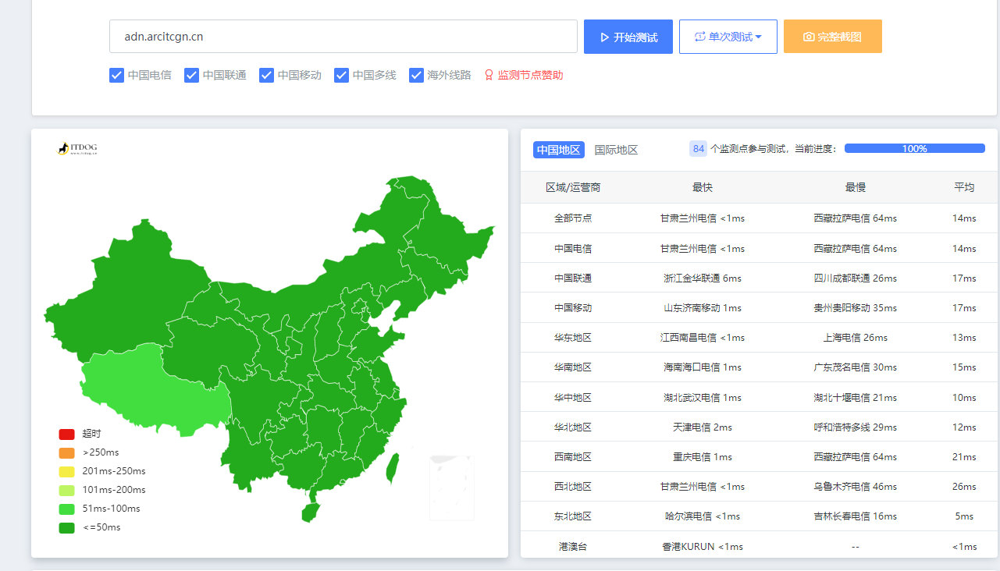
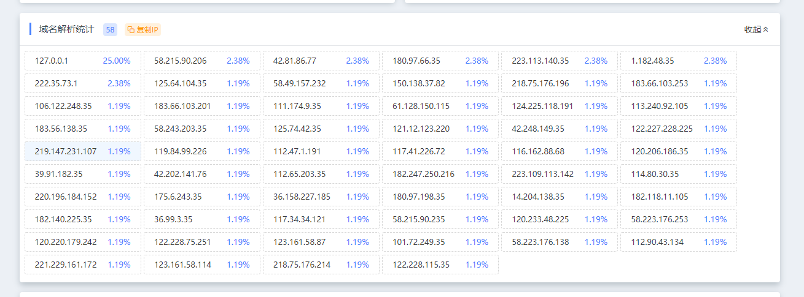

# 含义与工作方式，加速Feature 

ADN，就是A fast CDN，稳中求快

相关设置：所有文件缓存60天，强制https

它的工作方式是这样的：
NPM加速服务：

通过镜像回源的方式，将请求文件储存至USS，（类似于jsd的处理方式，可参考此文章：[ADN加速服务工作流程](https://arcitcgn.cn/185.html)

并同时在国内同时接入腾讯云，百度云，又拍云加速多家CDN共同加速（后续我们会考虑仅接入一家CDN)，

负载均衡，为用户提供优质的加速体验，

在线Ping测试：


除部分西部地区外，平均延迟≤25ms，平均响应IP数量在48-65之间（可能出现变化，后续考虑单一接入CDN）.


# 使用方法 
## 使用前，请您充分阅读并同意[ADN公益服务使用协议](https://arcitcgn.cn/189.html)
## npm包使用方法

npm地址：
```
https://adn.arcitcgn.cn/npm/包名@版本号/文件名
```
如何将资源上传到[npm](https://www.npmjs.com/)，可以参考以下两篇文章：

[npm图床的使用技巧](https://akilar.top/posts/3e956346/)

[利用GitHub Action自动发布你的静态资源到npm](https://bowenyoung.cn/posts/action-npm/)

## DNS预解析
DNS 预读取是一种使浏览器主动执行 DNS 解析以达到优化加载速度的功能。
将本加速服务融入DNS预解析，只需要在您网站的`<meta charset="UTF-8">`
后添加：
```
<link rel="dns-prefetch" href="//adn.arcitcgn.cn" />
```
# 结尾 

公益事业的蓬勃发展离不开我许多朋友的支持与帮助，

在此特别鸣谢[Teacher Du](https://dusays.com/)，[檐牙](https://www.zxma.top/)，[BeaCox](https://bowenyoung.cn/)，[Felix](https://www.felixchen0707.cn/)和[小邢同学](https://aboke.net/)，

对于公益事业可能会出现的艰难险阻，我会尽自己一切力量地去战胜（也请各位网友规范使用，不要用做任何的非法用途），正如互联网总是在惊涛骇浪发展过来的！

## 补充：关于滥用行为

滥用指胡乱地或过度地使用，我们会在CDN后台追踪高流量使用的网页，判断其合法性；如出现滥用行为(**包括但不限于：将ADN作为您的全站图床**)，我们会进行屏蔽“拉黑”处理。
各位网友如果遇到滥用CDN的行为，可向：[adn@arcitcgn.cn](mailto:adn@arcitcgn.cn) 发送邮件，详见我们的[使用协议](https://arcitcgn.cn/189.html)

在此也希望能够造福各位博友！！谢谢

## 赞助ADN：如果您希望我们的项目更好地走下去，您可以赞助我们；您可以前往我们的[赞助页面](https://arcitcgn.cn/thanks.html)赞助我们
 

